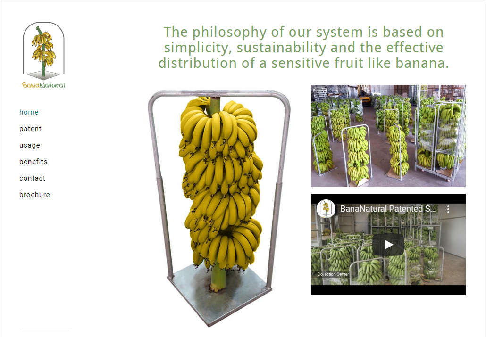
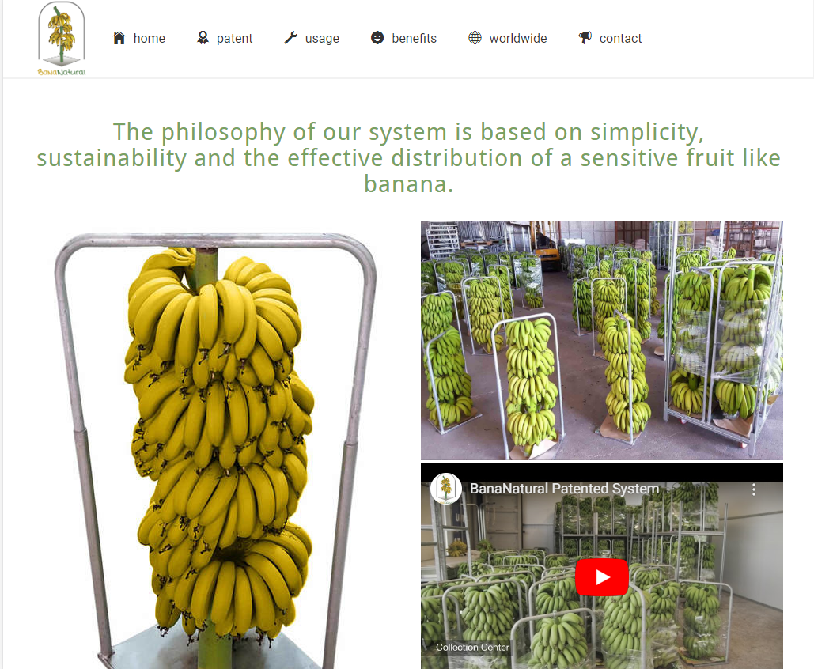
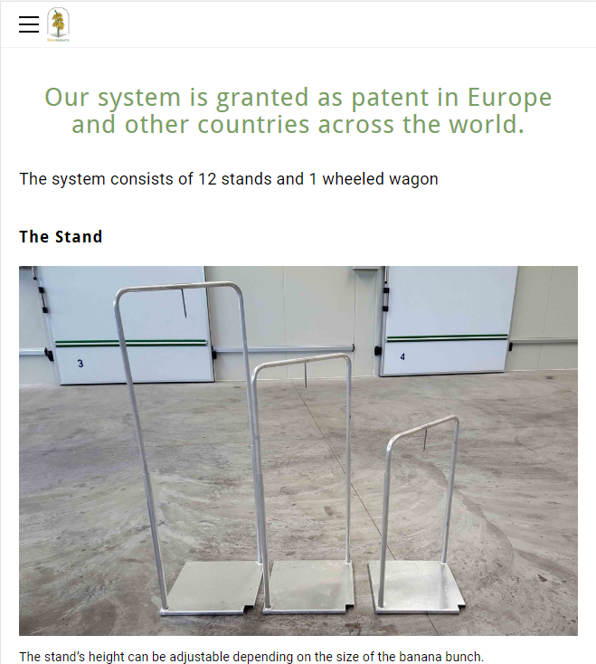
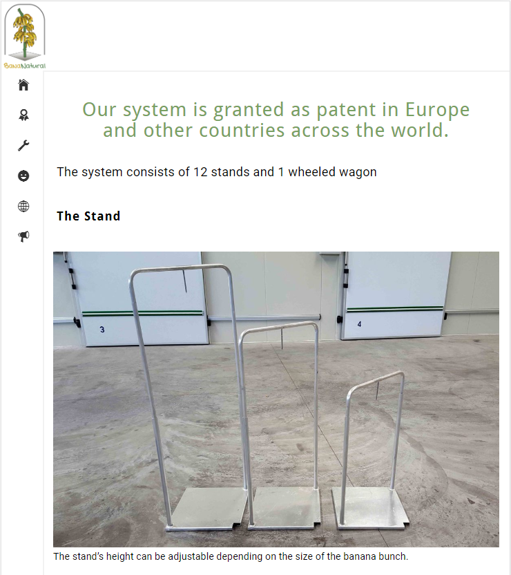

# Bananatural
A simple site for a company promoting his first patnet. First of all there was need for transforming the old HTML site into a Vue.js project.

</img> 
</img> 

</img> 
</img> 
## Project setup
```
npm install, 
for develop: npm run serve, 
for production: npm run build -> node server.js
```

### Bananatural on Heroku
See [https://vue-bananatural.herokuapp.com/](https://vue-bananatural.herokuapp.com/).

From [http://www.bananatural.com/](http://www.bananatural.com/).

### Useful links
* How to deploy a Vue.js project on heroku [Link](https://www.codementor.io/@ravianand1988/easily-4-steps-to-continuous-delivery-auto-deploy-vue-js-app-on-heroku-xljk977pq)
* How to pass .env files on Heroku bypassing Github [Link](https://devcenter.heroku.com/articles/config-vars)
